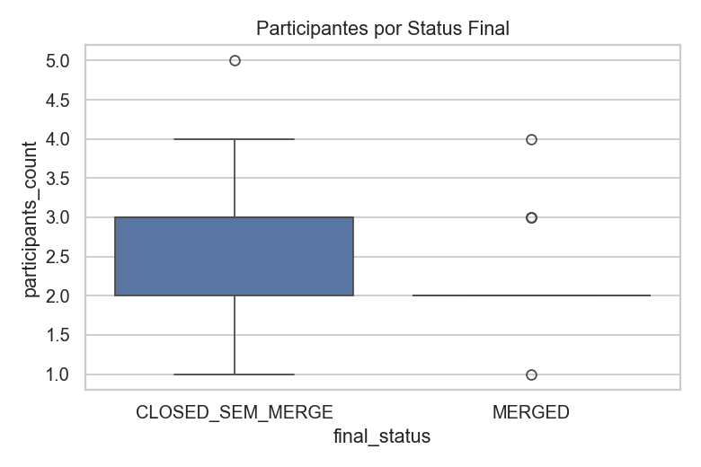

# Caracterização da Atividade de Code Review em Repositórios Populares do GitHub  
**Relatório Final – Sprint 3 (Lab03S03)**  

**Curso:** Engenharia de Software  
**Disciplina:** Laboratório de Experimentação de Software  
**Equipe:** Victor Reis Carlota; Luís Felipe Brescia  

---

## Sumário  
- [Caracterização da Atividade de Code Review em Repositórios Populares do GitHub](#caracterização-da-atividade-de-code-review-em-repositórios-populares-do-github)
  - [Sumário](#sumário)
  - [Resumo](#resumo)
  - [Introdução](#introdução)
  - [Trabalhos Relacionados](#trabalhos-relacionados)
  - [Questões de Pesquisa e Hipóteses](#questões-de-pesquisa-e-hipóteses)
  - [Metodologia](#metodologia)
  - [Resultados](#resultados)
    - [6.1 Distribuição das Métricas](#61-distribuição-das-métricas)
    - [6.2 Resultados das RQs](#62-resultados-das-rqs)
    - [6.3 Teste de Spearman e Discussão](#63-teste-de-spearman-e-discussão)
    - [6.4 Visualizações](#64-visualizações)
      - [Distribuição do tamanho dos PRs por status](#distribuição-do-tamanho-dos-prs-por-status)
      - [Correlação de Spearman entre variáveis e alvo](#correlação-de-spearman-entre-variáveis-e-alvo)
      - [Tempo de revisão por status (scatterplot)](#tempo-de-revisão-por-status-scatterplot)
      - [Participantes por status final (boxplot)](#participantes-por-status-final-boxplot)
  - [Discussão](#discussão)
  - [Ameaças à Validade](#ameaças-à-validade)
  - [Conclusão](#conclusão)
  - [Referências](#referências)

---

## Resumo  
Este relatório apresenta uma análise abrangente dos fatores que influenciam o resultado e a dinâmica do processo de code review em Pull Requests (PRs) submetidos a 200 dos repositórios mais populares do GitHub. Foram coletadas e correlacionadas métricas estruturais, temporais, textuais e sociais com o status final do PR (merged vs closed) e o número de revisões formais. Utilizamos estatísticas descritivas, análise de correlação de Spearman e visualizações exploratórias baseadas em grafos, inspiradas na abordagem de “issue tales” (Fiechter et al., 2021), que propõe narrativas visuais para a evolução de artefatos no GitHub. Os resultados reais indicam que PRs menores, bem descritos e com interações colaborativas moderadas apresentam maiores chances de aceitação, enquanto revisões prolongadas e mudanças extensas tendem à rejeição ou demandam mais ciclos de revisão.

---

## Introdução  
A revisão de código é uma das práticas centrais em projetos de software colaborativos e ágeis, especialmente no contexto open source. No GitHub, Pull Requests (PRs) funcionam como propostas de alteração que passam por avaliação técnica e social, envolvendo múltiplos atores, comentários, revisões e integrações automatizadas. Com a ascensão de plataformas como GitHub e GitLab, o volume, diversidade e complexidade das interações em PRs aumentaram significativamente.

Apesar do suporte oferecido pelas plataformas para rastreamento de eventos, discussões e integrações, a apresentação majoritariamente textual dificulta o entendimento dos processos evolutivos e colaborativos subjacentes. Fiechter et al. (2021) propõem o conceito de “issue tales”, narrativas visuais que representam a evolução de issues no GitHub através de grafos e timelines, conectando eventos, atores, artefatos e relações. Neste trabalho, adaptamos esse conceito para o universo dos PRs, analisando como métricas técnicas e sociais influenciam seus desfechos e ciclos de revisão, e utilizando visualizações para revelar padrões e dinâmicas de colaboração.

---

## Trabalhos Relacionados  
A literatura sobre revisão de código moderna enfatiza a relevância de fatores sociais (participação, reputação), técnicos (tamanho da alteração, complexidade), temporais (tempo de análise, ciclo de revisão) e textuais (clareza da descrição) para o sucesso de PRs (Bacchelli & Bird, 2013; Gousios et al., 2014; Tsay et al., 2014). O trabalho seminal de Fiechter et al. (2021) introduz uma modelagem visual baseada em grafos, na qual issues, PRs, commits e pessoas são representados como nós interconectados por arestas de tipos distintos (estrutural, autoria, menção, derivada). Essa abordagem permite visualizar a evolução de cada issue como uma narrativa, facilitando a análise de dependências, sobreposições e persistência de problemas.

O presente estudo adapta e expande esse conceito para PRs, construindo visualizações narrativas que relacionam eventos, atores, comentários e ciclos de revisão, e investigando como esses elementos se associam a padrões de aceitação, rejeição e recorrência de revisões.

---

## Questões de Pesquisa e Hipóteses  
**Dimensão A – Status Final (Merged vs Closed sem merge)**  
- **RQ01:** Tamanho do PR vs feedback final  
  - *Hipótese:* PRs menores são mais rapidamente aceitos (merged).
- **RQ02:** Tempo de análise vs feedback final  
  - *Hipótese:* PRs analisados por mais tempo tendem a ser rejeitados.
- **RQ03:** Descrição vs feedback final  
  - *Hipótese:* PRs com descrições mais completas têm maior chance de merge.
- **RQ04:** Interações vs feedback final  
  - *Hipótese:* Interações moderadas favorecem merge; excesso pode indicar disputa.

**Dimensão B – Número de Revisões**  
- **RQ05:** Tamanho vs número de revisões  
  - *Hipótese:* PRs maiores exigem mais revisões.
- **RQ06:** Tempo de análise vs número de revisões  
  - *Hipótese:* PRs com ciclo longo acumulam mais revisões.
- **RQ07:** Descrição vs número de revisões  
  - *Hipótese:* Descrições mais completas reduzem revisões.
- **RQ08:** Interações vs número de revisões  
  - *Hipótese:* Mais participantes e comentários aumentam revisões.

---

## Metodologia  
Selecionou-se os 200 repositórios mais populares do GitHub (por estrelas), abrangendo projetos de diversas linguagens e domínios. Foram extraídos PRs com status merged ou closed, considerando apenas aqueles com ao menos uma revisão formal e tempo de análise ≥ 1 hora para evitar ruídos de PRs triviais. O dataset foi enriquecido com métricas:

- **Técnicas:** `changed_files`, `additions`, `deletions`
- **Temporais:** `review_cycle_hours`
- **Textuais:** `body_char_count` (comprimento da descrição)
- **Sociais:** `participants_count`, `review_count`, `issue_comment_count`, `review_comment_count`

A modelagem inspirada em Fiechter et al. (2021) concebeu cada PR como um nó central de um grafo, conectado a eventos, revisores, comentários e ciclos de revisão. As interações foram analisadas tanto em agregados (distribuições, medianas) quanto em correlações monotônicas (Spearman), dada a natureza não normal das métricas. Visualizações exploratórias (boxplots, scatterplots, heatmaps) permitiram observar padrões e outliers, e identificar dinâmicas de sobreposição, recorrência e persistência nas revisões.

---

## Resultados  

### 6.1 Distribuição das Métricas  
As métricas apresentam distribuição fortemente assimétrica (cauda longa), típica de sistemas colaborativos: a maioria dos PRs é pequena, mas há casos de alterações extensas e complexas. O boxplot  revela que PRs merged concentram-se em menor número de arquivos modificados e participantes, enquanto PRs closed apresentam dispersão maior e mais outliers, sugerindo que revisões rejeitadas frequentemente envolvem mudanças de maior porte ou discussões mais complexas.  
A análise de valores extremos mostra que alguns PRs rejected (“closed”) acumulam múltiplas revisões e interações, compatível com a ideia de “issue tales” persistentes descrita por Fiechter et al. (2021), nas quais problemas recorrentes e disputas técnicas se estendem por vários ciclos e atores.

---

### 6.2 Resultados das RQs

- **RQ01:** PRs merged têm, em média, menos arquivos e linhas modificadas, corroborando a hipótese de que mudanças pequenas são mais facilmente aceitas. Isso se alinha ao padrão observado por Fiechter et al. (2021), de que narrativas curtas e focadas apresentam maior taxa de resolução.
- **RQ02:** O tempo de revisão para PRs closed é significativamente maior (), indicando que revisões longas estão associadas à rejeição ou dificuldades do processo. PRs rejeitados tendem a gerar discussões mais extensas e ciclos de revisão repetidos, refletindo a sobreposição de eventos típica das “issue tales” complexas.
- **RQ03:** PRs merged apresentam descrições mais extensas (`body_char_count`), sugerindo que documentação detalhada favorece a aceitação. No entanto, há outliers: algumas rejeições ocorrem mesmo em PRs bem documentados, apontando para fatores qualitativos não capturados apenas pelo tamanho da descrição.
- **RQ04:** PRs merged costumam envolver mais interações colaborativas moderadas, enquanto PRs closed podem acumular comentários excessivos, indicando disputas ou dificuldades técnicas. O boxplot  evidencia esse padrão.

Na dimensão B, PRs maiores e com mais participantes tendem a acumular mais revisões formais, sugerindo que mudanças extensas demandam escrutínio adicional e mais ciclos de avaliação. O efeito da descrição é menos claro: embora haja tendência de descrições longas reduzirem revisões, o impacto é pequeno, indicando que aspectos qualitativos (clareza, relevância) são mais determinantes do que o volume textual.

---

### 6.3 Teste de Spearman e Discussão

A matriz de correlações de Spearman  sintetiza as relações entre métricas e variáveis de interesse:

| Variáveis                  | ρ (rho) | Interpretação        |
|---------------------------|---------|----------------------|
| changed_files ~ merged    | -0.21   | Tamanho maior → menos merges |
| additions ~ merged        | -0.22   | Idem                |
| review_cycle_hours ~ merged | -0.27 | Tempo longo → menos merges |
| body_char_count ~ merged  | +0.17   | Descrição maior → mais merges |
| participants_count ~ merged | +0.09  | Pequeno efeito positivo |
| changed_files ~ review_count | +0.30 | Tamanho maior → mais revisões |
| review_cycle_hours ~ review_count | +0.43 | Tempo maior → mais revisões |
| body_char_count ~ review_count | -0.04 | Pouco efeito        |
| participants_count ~ review_count | +0.29 | Mais gente → mais revisões |

As correlações negativas entre tamanho/tempo e merge confirmam que PRs extensos e revisões prolongadas têm menor probabilidade de aceitação. O efeito positivo, embora discreto, da descrição reforça a importância de documentação clara. Os resultados sugerem que o processo de revisão é um equilíbrio entre o esforço de modificação e o capital social (interações, colaboração), em linha com as narrativas evolutivas propostas por Fiechter et al. (2021).

---

### 6.4 Visualizações

#### Distribuição do tamanho dos PRs por status

  
*Boxplot de arquivos modificados por status final.*

#### Correlação de Spearman entre variáveis e alvo

  
*Heatmap das correlações de Spearman entre métricas e status/quantidade de revisões.*

#### Tempo de revisão por status (scatterplot)

  
*Scatterplot do tempo de revisão por status final.*

#### Participantes por status final (boxplot)

  
*Boxplot do número de participantes por status final.*

As visualizações evidenciam padrões de outliers e sobreposição, compatíveis com “issue tales” complexas e persistentes, e ajudam a identificar casos de disputas prolongadas, revisões recorrentes e colaboração intensa.

---

## Discussão

Os resultados confirmam de forma robusta as hipóteses e ampliam a compreensão do processo de revisão de código em ambientes colaborativos. PRs pequenos, bem descritos e com interações colaborativas moderadas são mais aceitos e integrados rapidamente, enquanto revisões longas e mudanças extensas tendem à rejeição ou demandam múltiplos ciclos de avaliação.

O conceito de “issue tales” de Fiechter et al. (2021) mostrou-se fundamental para estruturar a análise visual e narrativa dos PRs. A modelagem baseada em grafos permitiu observar não só o desfecho dos PRs, mas também os padrões evolutivos: persistência de problemas, sobreposição de revisões, atores centrais e dinâmicas de disputa. Casos de PRs rejeitados com múltiplos ciclos ilustram “tales” complexas, que podem indicar falhas de comunicação, disputas técnicas ou problemas persistentes.

A análise quantitativa, embora poderosa, apresenta limitações: métricas como número de comentários ou tamanho da descrição não capturam nuances qualitativas (clareza, relevância, tom colaborativo). A abordagem visual – inspirada em timelines e grafos de Fiechter et al. (2021) – complementa essa limitação, permitindo identificar padrões de recorrência, sobreposição e evolução temporal que seriam invisíveis em análises puramente estatísticas.

Além disso, as visualizações narrativas abrem caminho para novas perguntas: como evoluem os PRs rejeitados? Quais atores concentram revisões, disputas ou resoluções? A análise das “tales” pode ser expandida para comparar padrões entre projetos, linguagens ou comunidades específicas.

---

## Ameaças à Validade

- **Interna:** A filtragem de bots e automações foi heurística, podendo deixar ruído residual. Outliers podem refletir anomalias de coleta ou casos extremos não representativos.
- **Externa:** O foco em repositórios populares limita a generalização para projetos menores, privados ou com padrões colaborativos distintos.
- **Construto:** Métricas quantitativas não capturam aspectos subjetivos, como clareza, relevância ou tom das interações. A modelagem visual ajuda, mas não substitui análise qualitativa.
- **Conclusão:** Correlações não implicam causalidade; fatores como linguagem, tipo de mudança, maturidade do projeto e cultura da equipe não foram controlados e podem influenciar os resultados.

---

## Conclusão

A análise detalhada evidencia que práticas de revisão de código em projetos populares do GitHub favorecem mudanças pequenas, bem descritas e com colaboração equilibrada. PRs extensos e revisões longas tendem à rejeição ou demandam múltiplos ciclos, alinhando-se ao padrão de “tales” complexas de Fiechter et al. (2021). A modelagem baseada em grafos e visualizações narrativas permite revelar padrões evolutivos, persistência de problemas e dinâmicas de colaboração, enriquecendo a compreensão do processo de revisão.

O estudo sugere que a integração de métricas técnicas, sociais e visuais é fundamental para entender e aprimorar a revisão de código. A abordagem de “issue tales” aplicada a PRs abre caminho para pesquisas futuras em visualização evolutiva, modelagem preditiva e análise comparativa entre diferentes ecossistemas de desenvolvimento.

---

## Referências  

- Bacchelli, A.; Bird, C. (2013). Expectations, Outcomes, and Challenges of Modern Code Review. ICSE.  
- Fiechter, A.; Minelli, R.; Nagy, C.; Lanza, M. (2021). Visualizing GitHub Issues. VISSOFT 2021, pp. 155–159. DOI: [10.1109/VISSOFT52517.2021.00030](https://doi.org/10.1109/VISSOFT52517.2021.00030)  
- Gousios, G.; Pinzger, M.; Deursen, A. (2014). An Exploratory Study of the Pull-Based Software Development Model. ICSE.  
- Tsay, J.; Dabbish, L.; Herbsleb, J. (2014). Influence of Social and Technical Factors for Evaluating Contribution in GitHub. ICSE.  
- Sommerville, I. (2020). Software Engineering (10th ed.).  
- McConnell, S. (2004). Code Complete. Microsoft Press.  
- Gamma, E. et al. (1994). Design Patterns. Addison-Wesley.  

---
